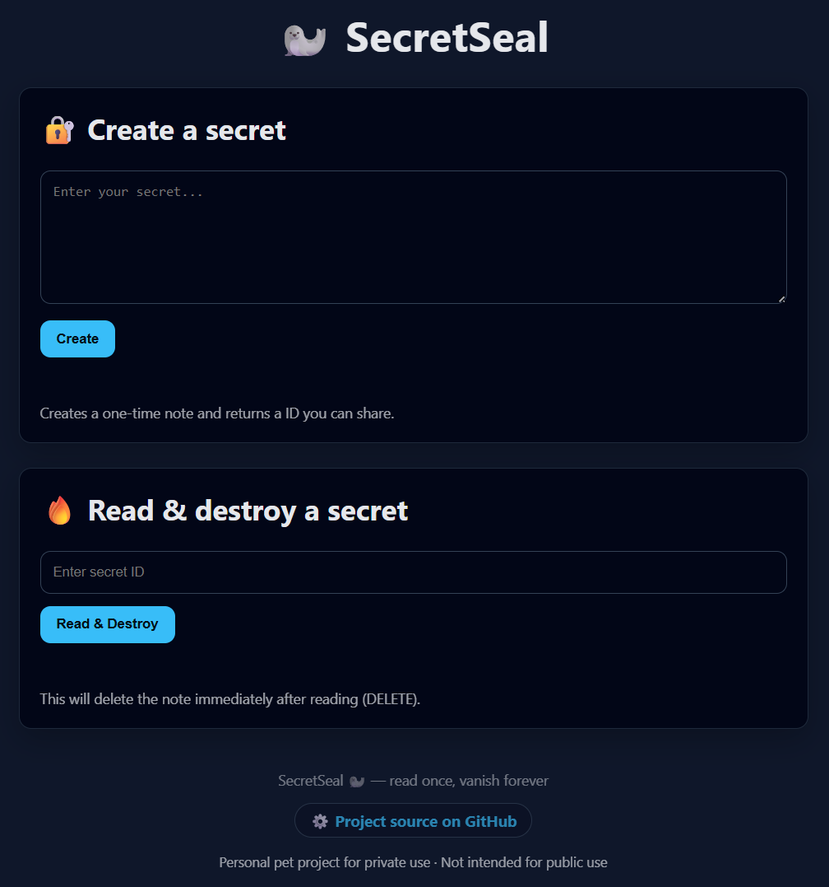

## 🦭🔐 SecretSeal

**SecretSeal** is a self-hosted, privacy-first service inspired by [privnote.com], designed for personal use and sharing secrets with friends.

It allows you to create **one-time readable messages** that are **automatically destroyed after being opened**.



Unlike public services, SecretSeal runs on **your own hosting**, so you always know **who has access to your data and where it lives**.

### ✨ Features
- 🗝️ One-time secret messages (read once, then gone)
- 🏠 Self-hosted — you own the infrastructure and data
- 💾 Flexible storage — choose between InMemory mode or a database storage
- 🚫 No ads, no tracking
- 🤝 Perfect for personal use and sharing secrets with friends

### 🔐 Encryption

Notes are stored **encrypted** using **AES-256**.

- Encryption key is provided via `appsettings.json`
- Plaintext data is never stored
- Protects against accidental disclosure (logs, memory dumps, debugging, crashes)

```json
  "Storage": {
    "Mode": "InMemory"
    // "Mode": "Database"
  },
  "ConnectionStrings": {
    "SecretSealDb": "Server=localhost\\SQLEXPRESS;..."
  },
  "Crypto": {
    "Key": "32-byte-secret-key"
  },
```

### 📊 Statistics

**GET `/stat`**

Returns basic runtime statistics.

```json
{
  "notesCount": 3,
  "encryptionEnabled": true,
  "isInMemory": true
}
```

| Field | Description |
|------|-------------|
| notesCount | Total number of stored notes |
| encryptionEnabled | Indicates whether notes are stored in the system in encrypted or plain text form |
| isInMemory | Indicates whether the application is currently using in-memory storage instead of a database |
