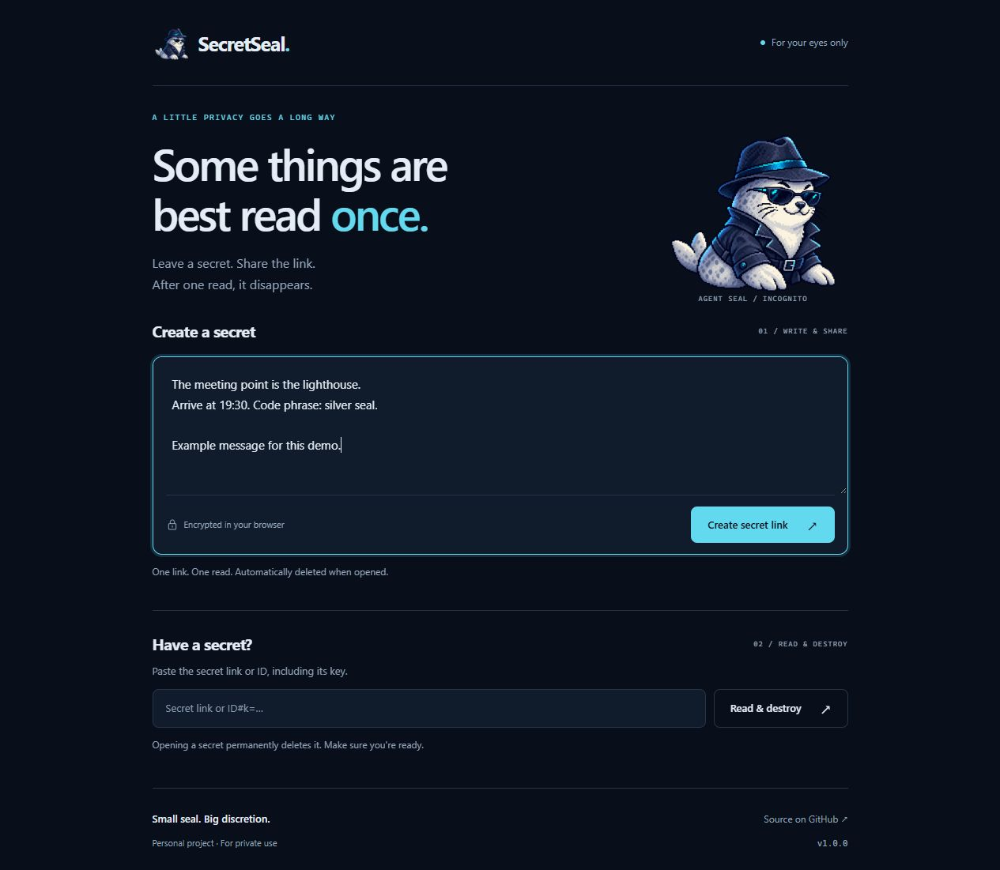
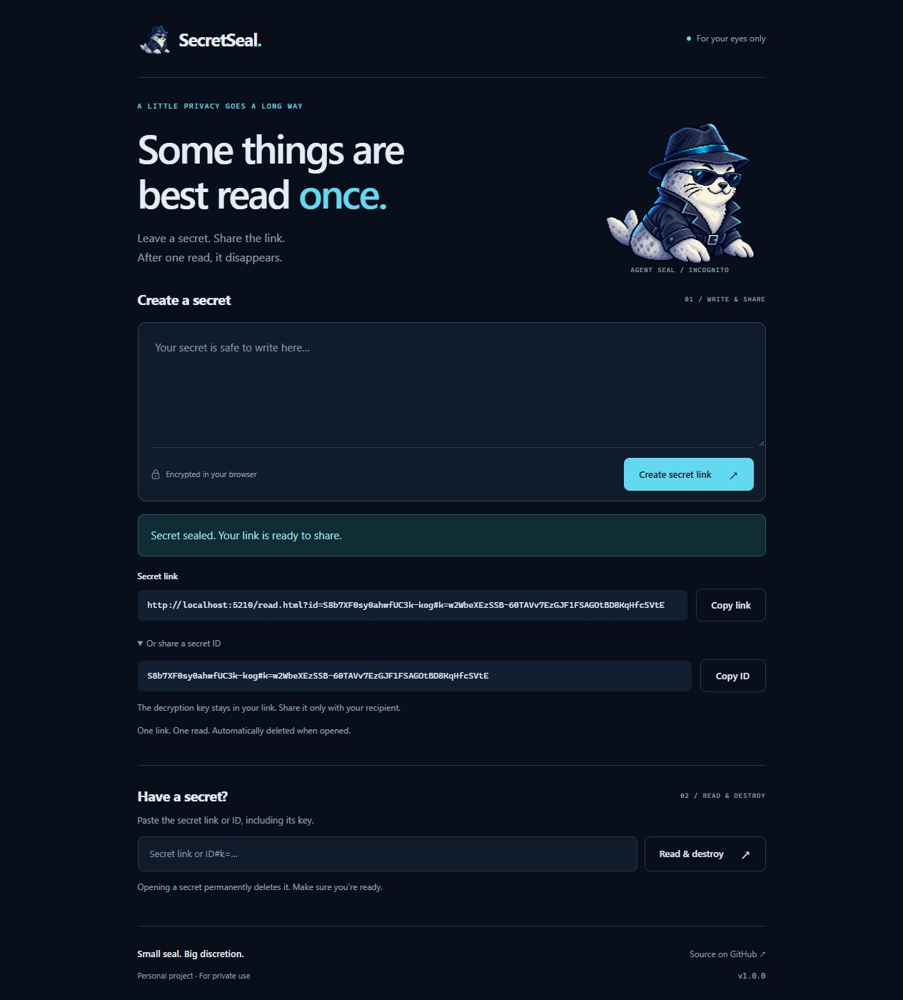
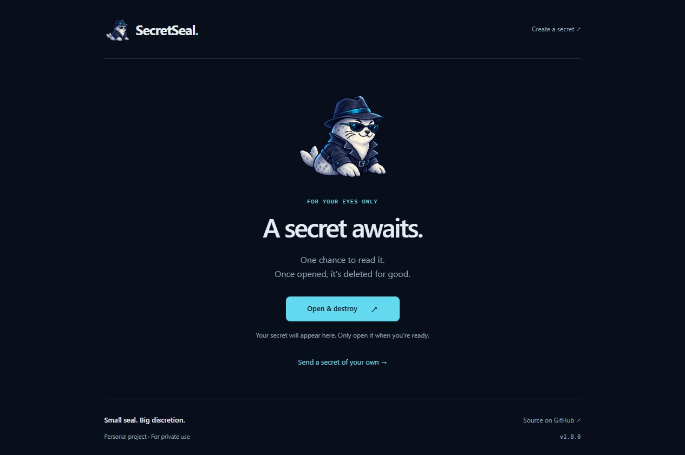
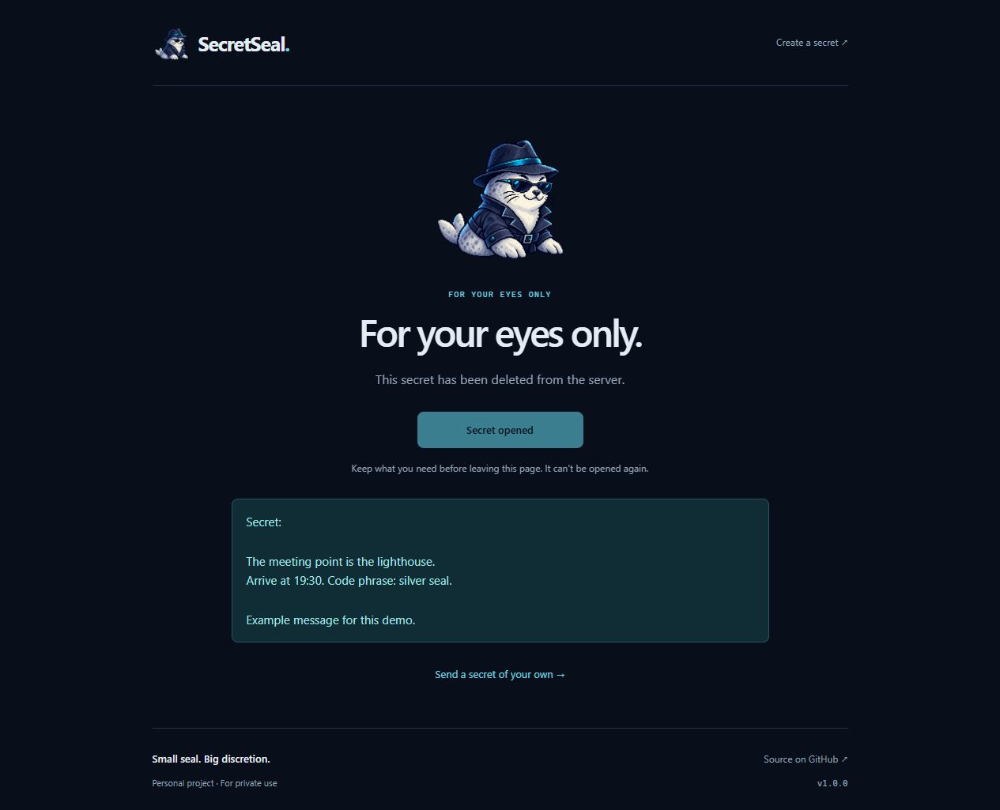
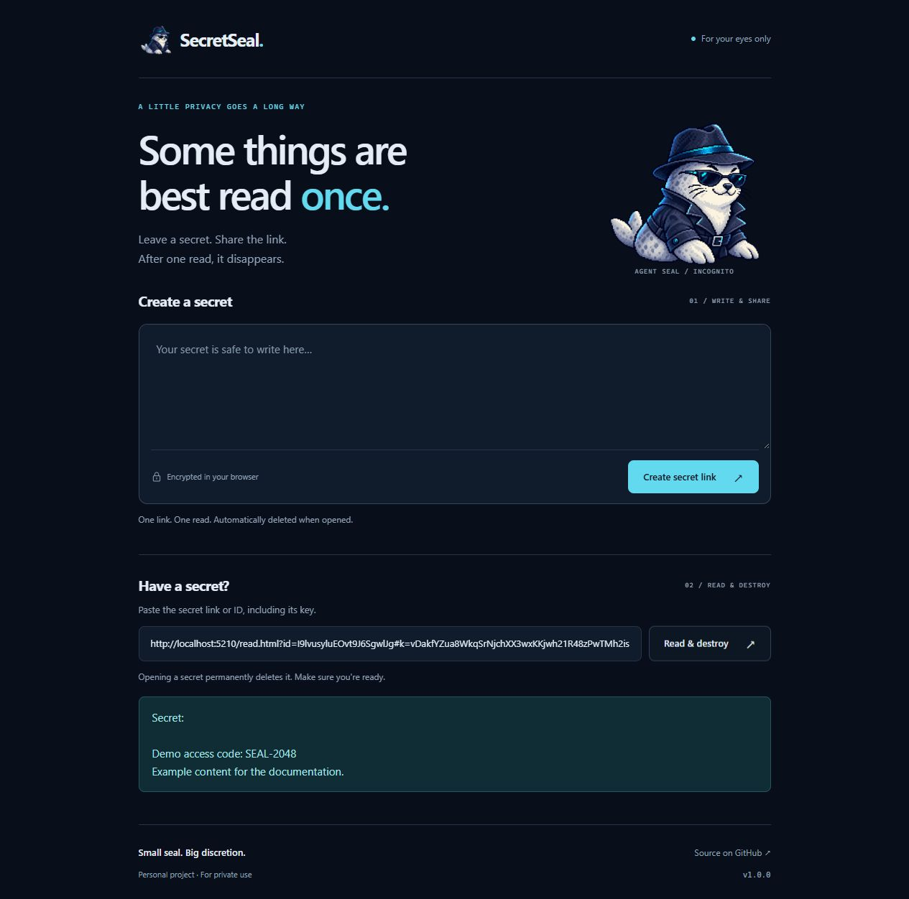
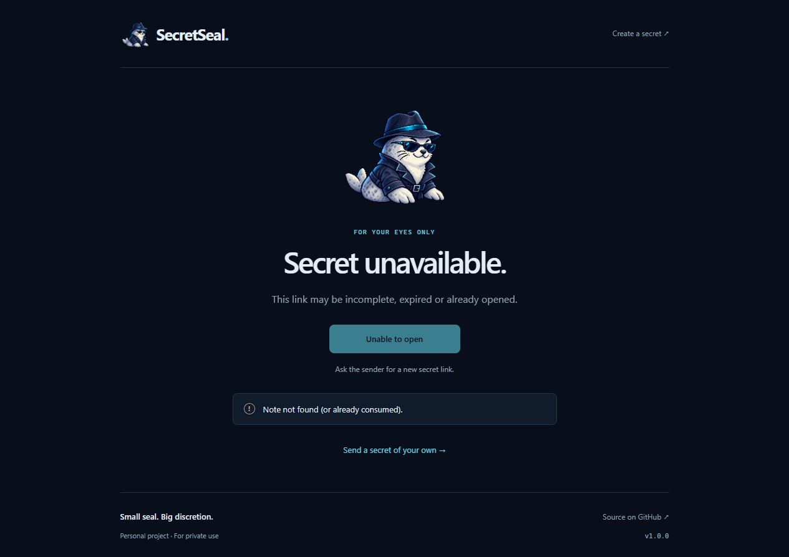
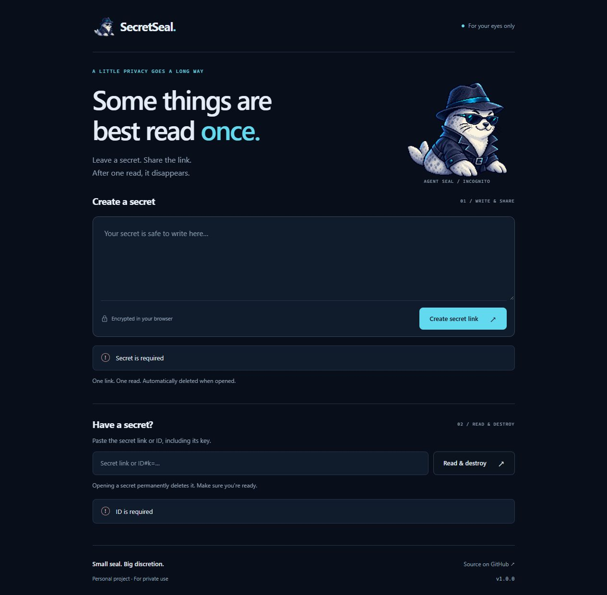
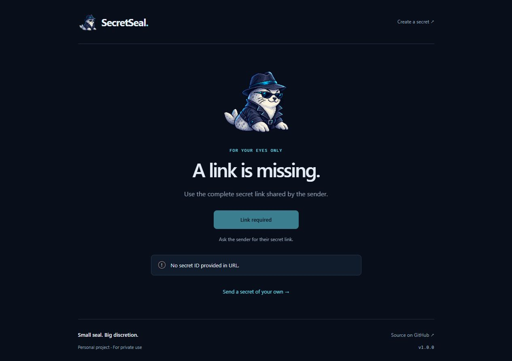
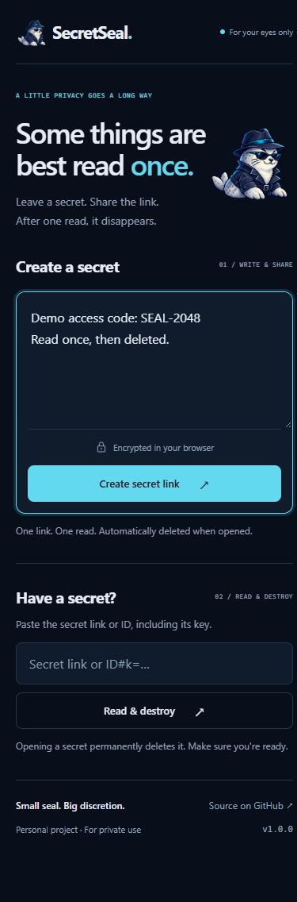
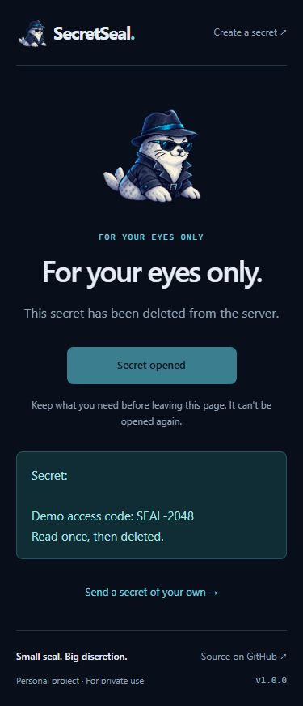

## 🦭🔐 SecretSeal

**SecretSeal** is a self-hosted, privacy-first service inspired by [privnote.com], designed for personal use and sharing secrets with friends.

It allows you to create **one-time readable messages** that are **automatically destroyed after being opened**.



SecretSeal runs on your own hosting, giving you full control over your data

### ✨ Features
- 🗝️ One-time secret messages (read once, then gone)
- 🏠 Self-hosted — you own the infrastructure and data
- 🔐 Client-side encryption and optional server-side encryption
- 💾 Flexible storage — choose between InMemory mode or a database storage
- 🚫 No ads, no tracking
- 🤝 Perfect for personal use and sharing secrets with friends

### UI walkthrough

These full-page screenshots show the current dark theme, pixel-art mascot, and version footer on a local `1.0.0` build. All messages are demonstration data; the links shown were consumed during capture and cannot be used to retrieve a secret.

**1. Create a secret.** Enter a message and choose **Create secret link**, as shown above. The message is encrypted in the browser before being sent to the server.

<details>
<summary>2. Share the generated link or secret ID</summary>

Copy the complete link with **Copy link**, or expand **Or share a secret ID** to use **Copy ID**. Both include the decryption key. Share the complete value with the recipient.



</details>

<details>
<summary>3. Open the received link</summary>

Visiting the link shows a confirmation screen. The secret is only consumed when the recipient chooses **Open & destroy**.



</details>

<details>
<summary>4. Read the secret once</summary>

The decrypted message appears on the recipient's screen, and the stored secret is deleted. Keep any information you need before leaving: the link cannot be opened again.



</details>

<details>
<summary>5. Read a link or ID directly on the home page</summary>

Alternatively, paste the complete link or composite ID (including its key) into **Have a secret?** and choose **Read & destroy**. The message appears below the input.



</details>

<details>
<summary>6. Try to reopen an already consumed secret</summary>

A second attempt shows **Secret unavailable**. An expired or incomplete link can also lead to this state; ask the sender for a new link.



</details>

<details>
<summary>7. Submit an empty message or secret ID</summary>

Inline validation explains which value is required without navigating away from the form.



</details>

<details>
<summary>8. Visit the read page without a secret link</summary>

Opening the read page without an ID shows **A link is missing** and keeps the open action disabled.



</details>

<details>
<summary>Mobile UI: creating and reading a secret</summary>

The same flow adapts to a narrow screen. These screenshots were captured at a 390-pixel viewport width.

| Create a secret | Read a secret |
| --- | --- |
|  |  |

</details>

### Testing

See [testing and coverage](docs/testing.md) for the test layers, coverage audit, and commands for running the SQL Server and browser smoke tests.

### 🔐 Encryption

#### Client-side encryption
Before sending, the note is encrypted in the browser using AES-256-GCM (Web Crypto API).
Key is generated per note and stored only in the share link’s URL fragment (#k=), so it is never sent to the server. 
The server stores only the encrypted payload (IV + ciphertext), and decryption happens only on the client when the recipient opens the link

The secret is accessed using the following format:

`<sealId>#k=<secretKey>`

Where:

- `<sealId>` — the note identifier used to locate the encrypted record on the server.
- `<secretKey>` — the client-side decryption key used to decrypt the content in the browser.

The server only uses `<sealId>` to fetch the encrypted payload.  
The `<secretKey>` is never sent to the backend and is used exclusively on the client side for decryption.

Example:
`https://<your-url>/read.html?id=gANSqy_0RkCeSIGN3bKO1w#k=azk6F5OGDFsJjd7GG1Fw4VSEU0U8PYfQzYaSzOjqnpg`

#### Server-side encryption
In case the service is used as an API, server-side encryption is also supported.
Notes on a server side are stored **encrypted** using **AES-256**.

- Encryption key is provided via `appsettings.json`
- Plaintext data is never stored
- Protects against accidental disclosure (logs, memory dumps, debugging, crashes)

```json
  "Storage": {
    "Mode": "InMemory"
    // "Mode": "Database"
    // "Mode": "InMemory"
  },
  "Validation": {
    "MaxNoteLength": 4000 // Optional content length limitation
  },
  "NotesCleaner": {
    "DaysToKeep": 30, // Retention window (days)
    "CleanupInterval": "01:00:00" // Run cleanup every hour (hh:mm:ss)
  },
  "ConnectionStrings": {
    "SecretSealDb": "Server=localhost\\SQLEXPRESS;..."
  },
  "Crypto": {
    "Key": "32-byte-secret-key" // Example: rQw8xFJ8242pY0xJqYG5xNn4R1h1s97Z
  },
```

### 📊 Statistics

**GET `/stat`**

Returns basic runtime statistics.

```json
{
  "notesCount": 3,
  "encryptionEnabled": true,
  "isInMemory": true
}
```

| Field | Description |
|------|-------------|
| notesCount | Total number of stored notes |
| encryptionEnabled | Indicates whether notes are stored in the system in encrypted or plain text form |
| isInMemory | Indicates whether the application is currently using in-memory storage instead of a database |

### Project version

The footer on both pages loads the running application's SemVer from **GET `/version`**.
The default version is `1.0.0`, set in `src/SecretSeal/SecretSeal.csproj`; the UI does not contain a separate version number.

Pushing a SemVer tag such as `v1.0.0` (or `1.0.0`) runs `.github/workflows/release-build.yml`.
It validates the tag, tests the application, and creates a deployable `SecretSeal-1.0.0` artifact with that version embedded in the assembly. Deploy that artifact to display the tag's version on the site. The workflow does not deploy automatically.

For a manual build, pass the release version explicitly:

```sh
dotnet publish src/SecretSeal/SecretSeal.csproj -c Release -p:Version=1.0.0 -o artifacts/SecretSeal
```

Prerelease versions and build metadata (for example, `1.1.0-rc.1+build.42`) are preserved. The SDK's automatic Git SHA suffix is disabled so the footer matches the supplied SemVer exactly. See the [.NET assembly version documentation](https://learn.microsoft.com/dotnet/standard/assembly/set-attributes-project-file).

### Retention policy

**GET `/retention-policy`**

Returns the configured retention window in days.
If the application runs in InMemory mode, the endpoint returns `-1`.

```json
{
  "daysToKeep": 30
}
```

### 🧹Notes cleanup

When storage mode is set to Database, the application runs a background cleanup job.
It removes notes older than the configured retention window and repeats on a schedule.

Configuration:
- `NotesCleaner:DaysToKeep` is the retention window in days.
- `NotesCleaner:CleanupInterval` is the interval between cleanup runs (TimeSpan format).
